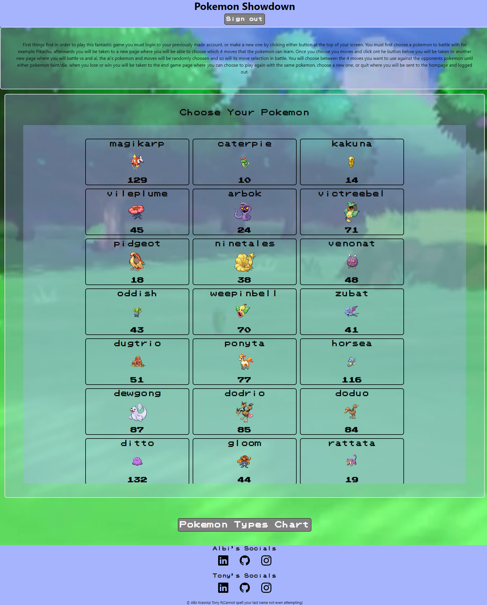
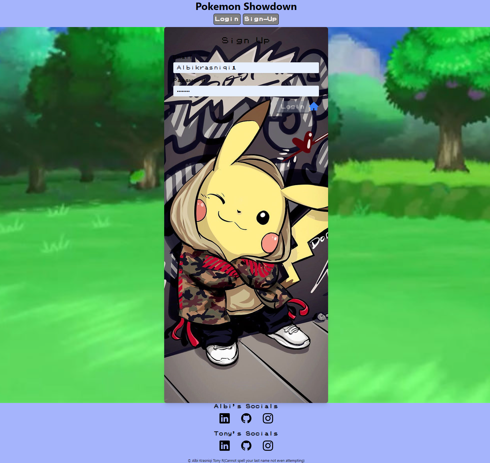
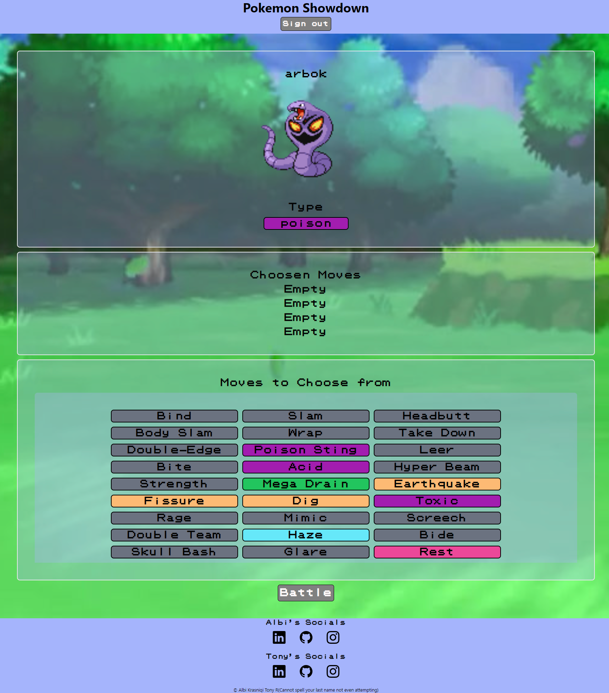
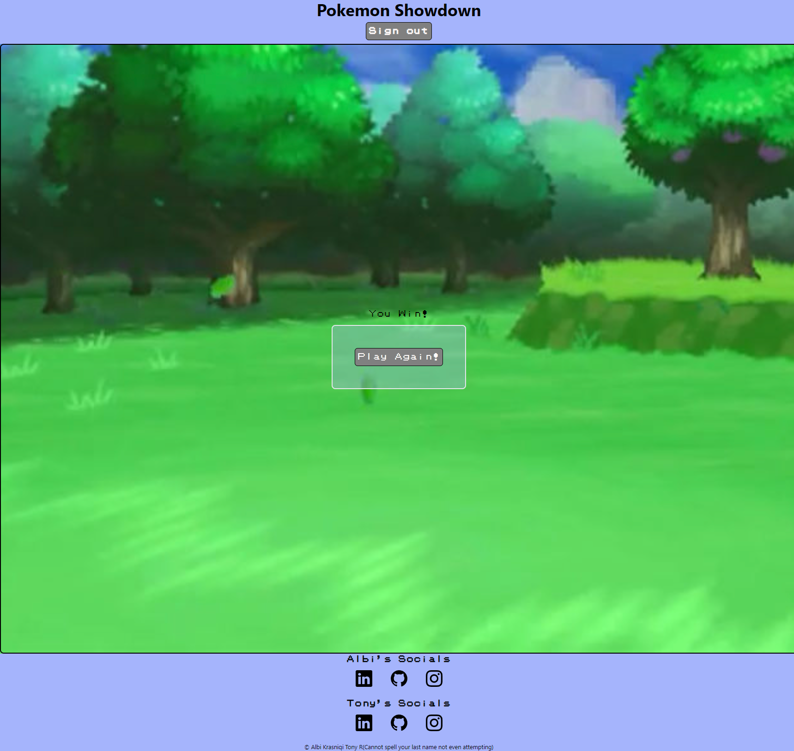

# PokemonBattleGround

## Badges

## Description

- Motivation: Our motivation to create this project was our love for the childhood game pokemon, that and we wanted to do a challenge, which it was challenging.
- Goal: to see how far our skills within the third section of this bootcamp has come
- Problems Solved: it solves being able to play pokemon without buying and 1000 switch
- What I Learned: we learned a lot about querying data and overall how annoying graphql can be but we got through it with most of our sanity intact

## Installation

Node

## Credits

Albi Krasniqi: https://github.com/Albikras?tab=repositories

## License

This program is done under the license: [MIT License](https://choosealicense.com/licenses/mit/)

## How To Contribute

## Questions

GitHub: https://github.com/Douped

If you want to reach me with additional question click my email link here: Tony@Email.here

GitHub: https://github.com/Albikras?tab=repositories

If you want to reach me with additional question click my email link here: Krasniqi1287@gmail.com

## Links

Heroku:https://radiant-peak-95315-846b2c46030b.herokuapp.com/
Presentation: https://docs.google.com/presentation/d/1u3SqtZ8oA4h0vyfLrYQlM1KPKwEIfdtnjnHUu1ysrbs/edit?usp=sharing

## Screenshot

